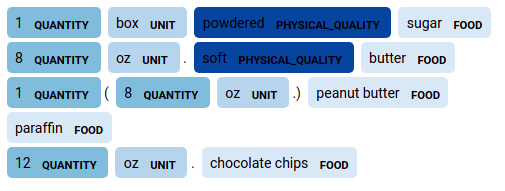

# TASTEset

This is a dataset for food entities recognition problem. It consists of 1,000
manually annotated recipes' ingredients. Recipes were scraped from the 
following websites:
* https://www.allrecipes.com
* http://food.com
* https://tasty.co
* www.yummly.com

using this [tool](https://github.com/hhursev/186recipe-scrapers). 

The dataset encapsulates 15 entities:

**FOOD, UNIT, QUANTITY, PHYSICAL QUALITY, PROCESS, COLOR, TASTE, PURPOSE,
PART, TRADE NAME, DIET, EXAMPLE, EXCLUDED, EXCLUSIVE, POSSIBLE SUBSTITUTE**.

The dataset is available in the CSV format, [here](data/TASTEset.csv). It 
contains two columns:
* _ingredients_ - list of recipe's ingredients
* _ingredients_entities_ - entities manually annotated in the list of ingredients

The _ingredients_entities_ are of the following format:
* "span": list of tuples, each tuple contains of the start and end character id.
If more tuples are present, it means that the entity is discontinuous.
* "type": entity type
* "entity": entity

An example from the dataset:

List of ingredients
- 1 box powdered sugar
- 8 oz. soft butter 
- 1 (8 oz.) peanut butter   
- paraffin  
- 12 oz. chocolate chips 



More details on the dataset can be found in our paper.


# Project environment

Python 3.6.9 has been used. If you have other version, perhaps you might need to
adjust the `requirements.txt`. You can also consider 
using [pyenv](https://github.com/pyenv/pyenv).

1) If you use virtualenv
```bash
python -m venv tasteset_env
. ./tasteset_env/bin/activate
pip install --upgrade pip  # upgrade pip to newest version
pip install -r requirements.txt
python -m spacy download en_core_web_sm
```

2) If you use pyenv
```
pyenv virtualenv 3.6.9 tasteset_env
pyenv activate tasteset_env
pip install --upgrade pip  # upgrade pip to newest version
pip install -r requirements.txt
python -m spacy download en_core_web_sm
```

To freely import all scripts, please add the followings to the PYTHONPATH:
```bash
export PYTHONPATH=PYTHONPATH:<path-to-tasteset-repo>/src
```


# Baselines

Below are F<sub>1</sub>-score results of state-of-the-art models on 5-fold 
cross-validation. 
You can run your own experiments, please refer to the following [folder](experiments).

Note that these results do not include the rarest entities: **EXCLUDED**, 
**EXCLUSIVE**, **POSSIBLE SUBSTITUTE**.

|       **Entity**        | BERT<sub>base-uncased</sub> |    BERT<sub>base-cased</sub>     | BERT<sub>large-cased</sub> |    BioBERT    |    FoodNER    |    BERT with CRF     |       LUKE        |
|:-----------------------:|:---------------------------:|:--------------------------------:|:--------------------------:|:-------------:|:-------------:|:--------------------:|:-----------------:|
|        **FOOD**         |       0.921 +- 0.006        |          0.927 +- 0.010          |     **0.932 ± 0.006**      | 0.823 ± 0.020 | 0.928 ± 0.008 |    0.928 ± 0.006     |   0.923 ± 0.004   |
|      **QUANTITY**       |       0.982 +- 0.002        |        **0.986 +- 0.001**        |       0.984 ± 0.003        | 0.893 ± 0.012 | 0.985 ± 0.001 |    0.984 ± 0.003     |   0.981 ± 0.003   | 
|        **UNIT**         |       0.979 +- 0.008        |        **0.983 +- 0.006**        |       0.982 ± 0.007        | 0.884 ± 0.020 | 0.982 ± 0.008 |    0.982 ± 0.007     |   0.977 ± 0.008   | 
|       **PROCESS**       |       0.928 +- 0.008        |          0.938 +- 0.012          |     **0.939 ± 0.010**      | 0.817 ± 0.013 | 0.934 ± 0.006 |    0.930 ± 0.008     |   0.903 ± 0.008   |
|  P**HYSICAL QUALITY**   |       0.824 +- 0.032        |        **0.830 +- 0.017**        |       0.829 ± 0.025        | 0.751 ± 0.043 | 0.822 ± 0.025 |    0.816 ± 0.024     |   0.795 ± 0.020   |
|        **COLOR**        |       0.907 +- 0.022        |          0.926 +- 0.016          |       0.917 ± 0.022        | 0.786 ± 0.047 | 0.921 ± 0.016 |  **0.931 ± 0.008**   |   0.898 ± 0.024   |
|        **TASTE**        |       0.848 +- 0.030        |          0.854 +- 0.027          |     **0.876 ± 0.014**      | 0.793 ± 0.039 | 0.854 ± 0.028 |    0.854 ± 0.057     |   0.791 ± 0.046   |
|       **PURPOSE**       |       0.832 +- 0.056        |        **0.875 +- 0.054**        |       0.872 ± 0.050        | 0.724 ± 0.097 | 0.857 ± 0.056 |    0.814 ± 0.078     |   0.790 ± 0.048   |
|        **PART**         |       0.744 +- 0.014        |          0.764 +- 0.058          |     **0.831 ± 0.058**      | 0.785 ± 0.050 | 0.789 ± 0.054 |    0.820 ± 0.070     |   0.783 ± 0.077   |
|     **TRADE NAME**      |       0.444 +- 0.107        |          0.538 +- 0.034          |     **0.612 ± 0.110**      | 0.145 ± 0.069 | 0.543 ± 0.053 |    0.557 ± 0.113     |   0.544 ± 0.031   |
|        **DIET**         |       0.668 +- 0.101        |          0.687 +- 0.095          |       0.711 ± 0.099        | 0.650 ± 0.086 | 0.668 ± 0.122 |  **0.751 ± 0.059**   |   0.661 ± 0.089   |
|       **EXAMPLE**       |       0.422 +- 0.069        |          0.466 +- 0.071          |       0.518 ± 0.125        | 0.216 ± 0.156 | 0.430 ± 0.097 |    0.414 ± 0.097     | **0.537 ± 0.052** |
|         **all**         |       0.933 +- 0.007        |          0.941 +- 0.006          |     **0.943 ± 0.004**      | 0.842 ± 0.018 | 0.939 ± 0.005 |    0.938 ± 0.003     |   0.928 ± 0.005   |

Please refer to our paper for models' details.
